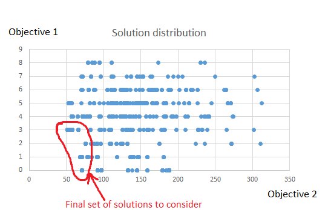

# Multi-objective-simulated-annealing
## Description
This programme was written based on the paper [A Simulated Annealing-Based Multiobjective Optimization Algorithm: AMOSA](https://ieeexplore.ieee.org/document/4358775). The programme considers the following problem:
## 
Given a number of deliveries between some places and a number of carriers to perform the deliveries, how to schedule each carrier such that the carriers can fulfill all the deliveries in the least time necessary?
## 
A typical simulated annealing algorithm will be able to find a good solution to a problem with only 1 objective to meet. However, in this problem, there are 2 objectives: 
1. Reduce the time spent in deliveries
2. Ensure all deliveries are fulfilled
## 
Hence a multi-objective simulated algorithm was used, which considers solutions where no one solution is strictly better than the other (ie. a solution may fare better at one objective but worse at another) and find a way to filter through them. The diagram belows shows a typical spread of solutions between 2 objectives and the algorithm's aim is to search out the final set of solutions (in red) and then pick a solution based on requirement of the problem. 

